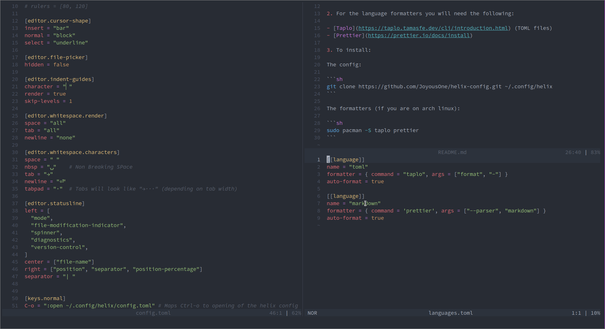

# Helix config

My helix text editor config



## Table of content:

- [Installation](#installation)

## Installation

1. You will need [Helix](https://docs.helix-editor.com/install.html)

2. For the language formatters you will need the following:

- [Taplo](https://taplo.tamasfe.dev/cli/introduction.html) (TOML files)
- [Prettier](https://prettier.io/docs/install)
- [Go](https://helix-editor.vercel.app/reference/language-servers#go)
```sh
go install golang.org/x/tools/gopls@latest                            # LSP
go install github.com/go-delve/delve/cmd/dlv@latest                   # Debugger
go install golang.org/x/tools/cmd/goimports@latest                    # Formatter
go install github.com/nametake/golangci-lint-langserver@latest        # Linter
go install github.com/golangci/golangci-lint/cmd/golangci-lint@latest # Linter cli

# Add the following to .zshrc file
export PATH="$HOME/go/bin:$PATH"
```
3. To install:

The config:

```sh
git clone https://github.com/JoyousOne/helix-config.git ~/.config/helix
```

The formatters (if you are on arch linux):

```sh
sudo pacman -S taplo prettier
```
